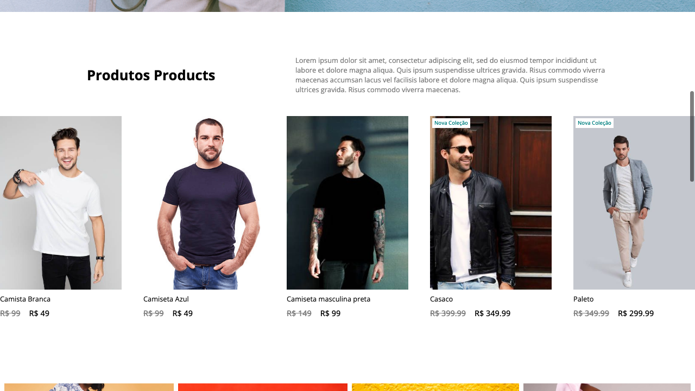
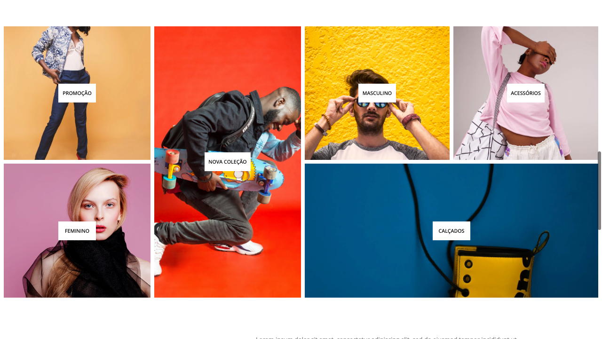
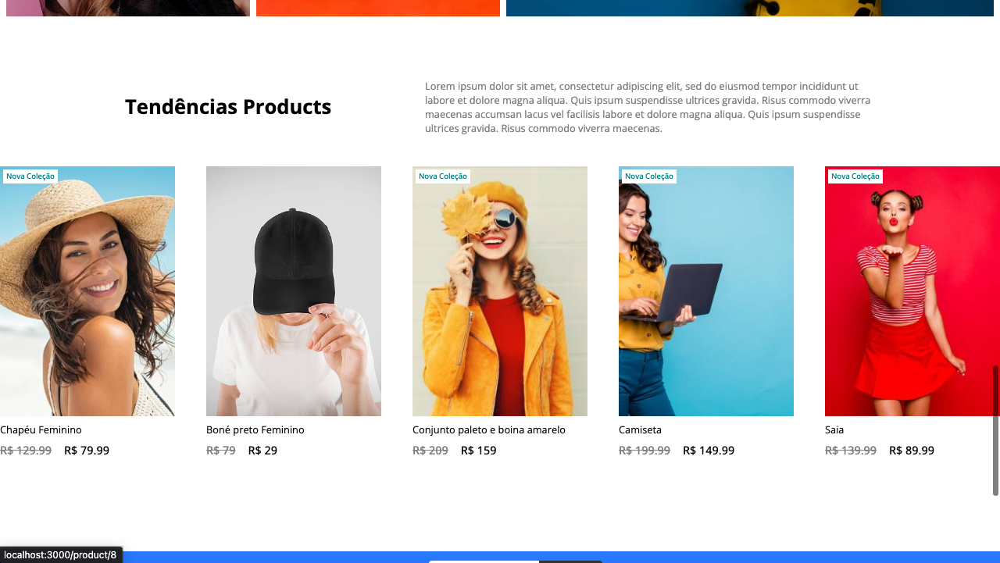
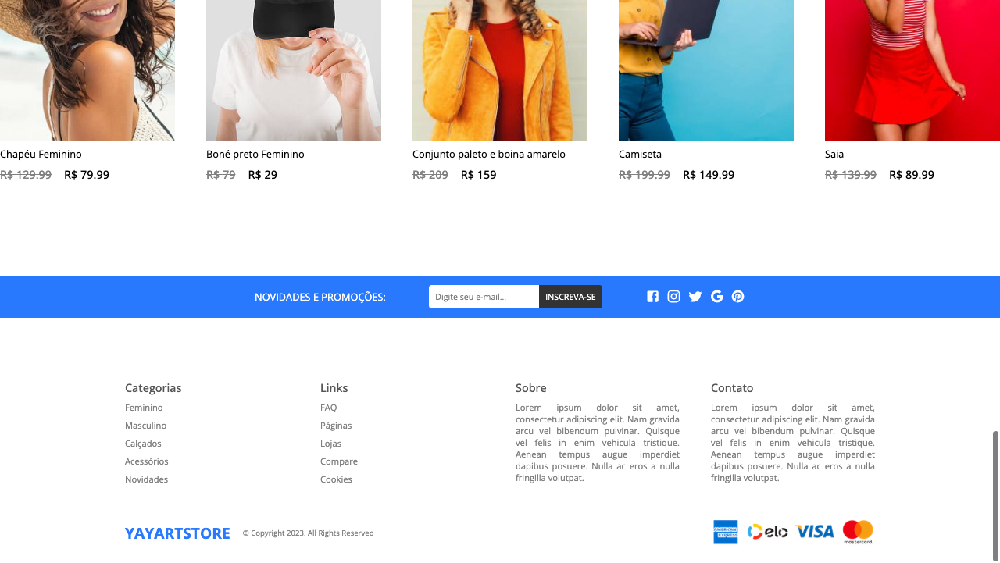
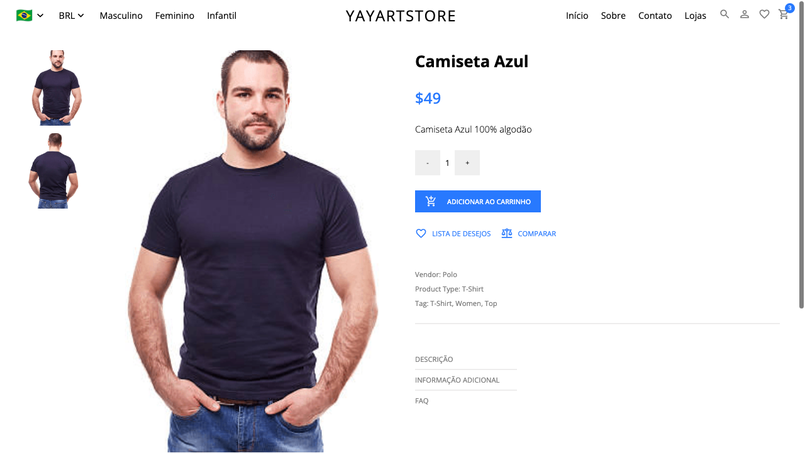
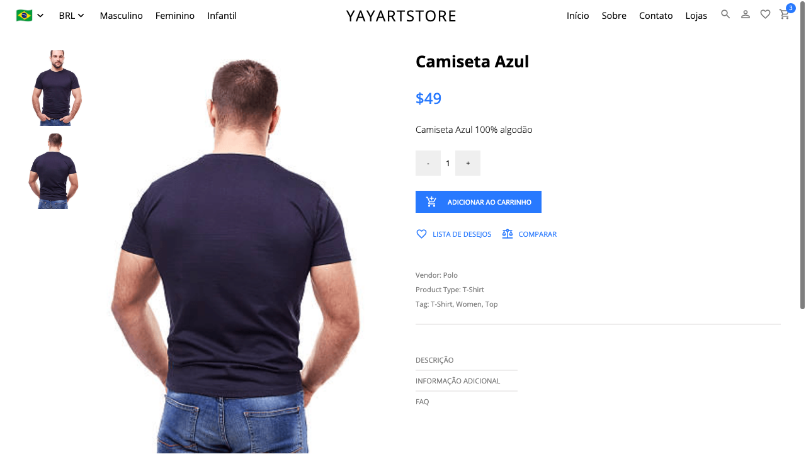
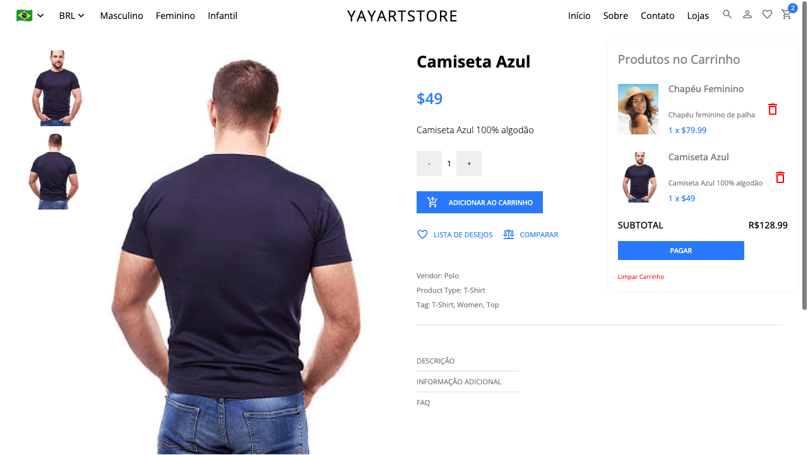
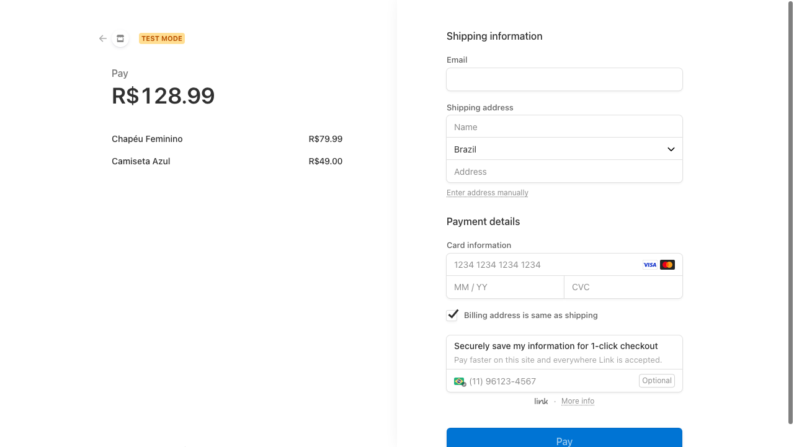

# REACT E-COMMERCE APP

This is a functional website I made using React for an imaginary Department Store. 

## Table of contents

- [Overview](#overview)
  - [Deploy](#deploy )
  - [The challenge](#the-challenge)
  - [Screenshots](#screenshot)
  - [My process](#my-process)
  - [Built with](#built-with)
  - [What I learned](#what-i-learned)
  - [Continued development](#continued-development)
  - [Useful resources](#useful-resources)
- [Author](#author)
- [Acknowledgments](#acknowledgments)

## Overview

Continuinig my development this is a project I made using React, SASS, Vanilla, Redux, Strapi and Stripe. I was a nice approach to a fullstack work and I'm quite proud of it. To run this project with all it's capabilities you'll need to clone de repository and install Redux, Strapi and Stripe. Especially if you want to use the simulation of the credit card payment on checkout. Run the Strapi API and the React Server.

### The challenge

The main challenge was to build a small but functional fullstack project, using api, database and putting into practice my skills on React and SASS. CRUD and DOM manipulation are also largely used on this project. Integration the front-end with the back-end was really fun and nice to study.

### Screenshots

Header and Hero Sections

Card Section

List Section

Next Card Section

Footer Section

Product Section 1

Product Section 2

Cart

CheckOut

## My process

As I was using React I managed to divide my project into parts which made easier to overcome problems througout the development. Using documentations and searching skills was a key hability to finish this project.

### Built with

- HTML
- SASS
- JavaScript
- React
- Node JS
- Redux
- Strapi
- Stripe

### What I learned

Improved my skills working with React, api's and database.

### Continued development

I now look forward improving my React Skills

### Useful-resources

React Documentation
Redux Documentation
Stripe Documentation
Strapi Documentation

## Author

Eduardo Vinagre (@eduvinagre)

## Acknowledgments

